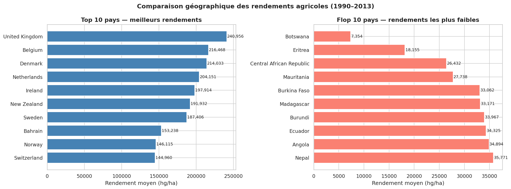
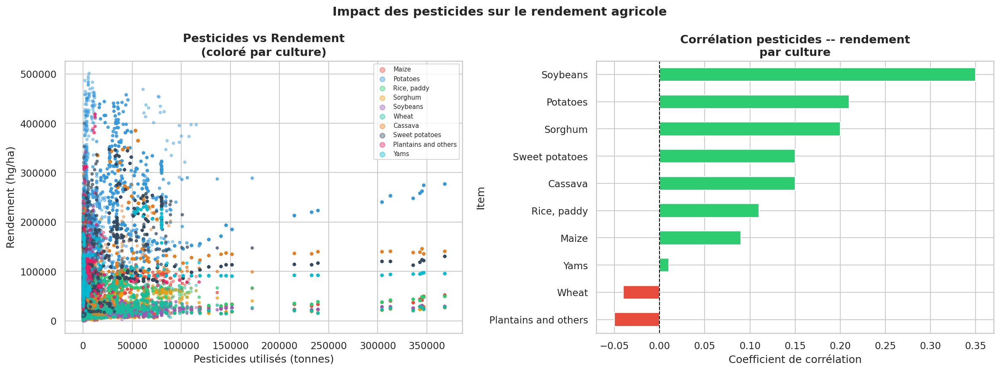
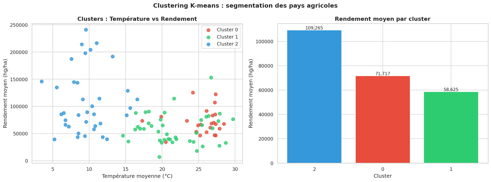
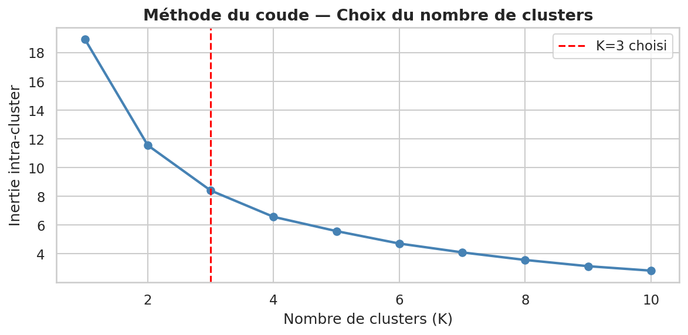
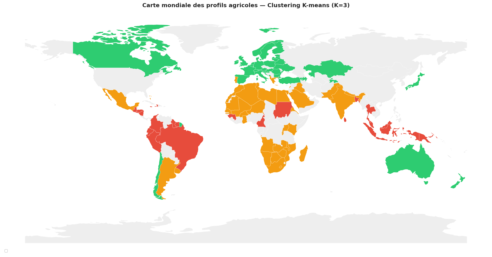
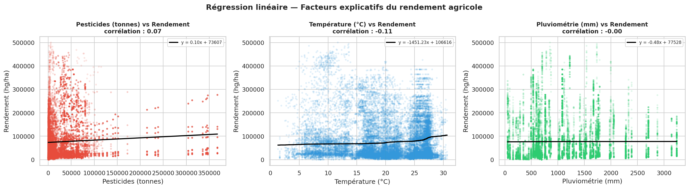
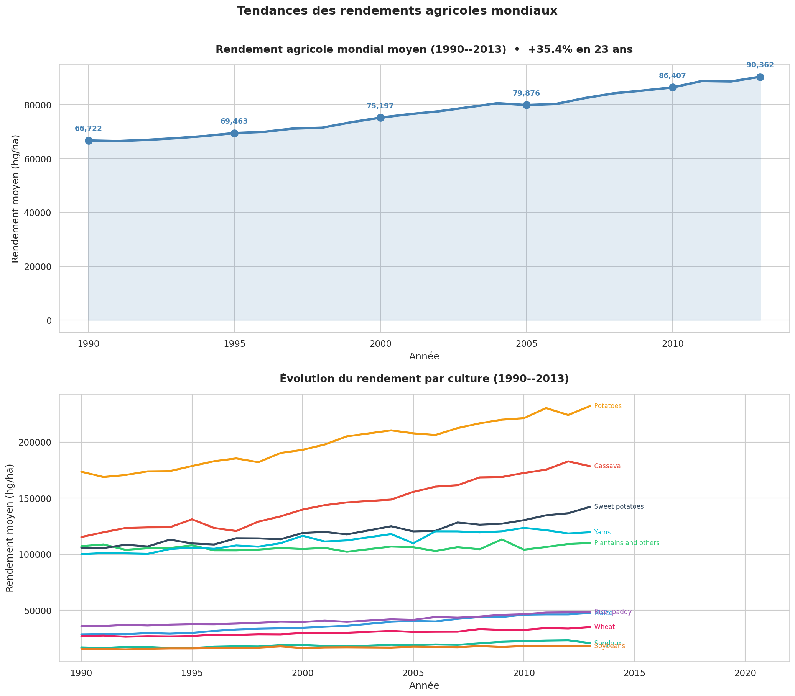

# 🌾 Analyse des facteurs influençant le rendement des cultures agricoles mondiales

> **Étude Data Science pour la Coopérative agricole InVivo**
> Master 1 Informatique parcours Data Science — Université d'Artois (2025–2026)

[](https://www.python.org/)
[](https://pandas.pydata.org/)
[](https://scikit-learn.org/)
[](https://jupyter.org/)

---

## 📌 Contexte

Ce projet a été réalisé en binôme dans le cadre du cours **Science des Données** du Master 1 Informatique à l'Université d'Artois, avec un cas d'étude réel : intervenir en tant que **Data Analysts pour la coopérative agricole française InVivo**.

**Objectif business :** identifier les facteurs qui influencent le plus le rendement des cultures à travers le monde, et formuler des recommandations stratégiques pour aider InVivo à orienter ses décisions de production.

**Auteurs :**
- 👤 **Aboubacar Sidiki YATTARA** — [@Aboubacar21](https://github.com/Aboubacar21)
- 👤 **Dissirama GOMNAH**

---

## 🎯 Problématique

> *Quels sont les facteurs qui déterminent le rendement agricole d'un pays, et peut-on les modéliser pour anticiper la production future ?*

Pour y répondre, nous analysons l'interaction entre 4 variables clés :
- 🌾 **Rendement** (hg/ha)
- 🧪 **Usage de pesticides** (tonnes)
- 🌧️ **Précipitations** (mm/an)
- 🌡️ **Température moyenne** (°C)

…à travers **101 pays** sur la période **1990–2013**.

---

## 📊 Données

Les données proviennent de la **FAO** (Organisation des Nations Unies pour l'alimentation et l'agriculture) et du **World Data Bank**.

| Fichier | Description | Lignes |
|---------|-------------|--------|
| `yield.csv` | Rendements par pays, culture et année | ~56 000 |
| `pesticides.csv` | Quantité de pesticides utilisée par pays/année | ~4 300 |
| `rainfall.csv` | Précipitations annuelles moyennes par pays | ~6 700 |
| `temp.csv` | Températures annuelles moyennes par pays | ~71 000 |
| `yield_df.csv` | **Dataset fusionné final** utilisé pour l'analyse | ~28 000 |

> 📁 Disponibles dans le dossier [`/data`](./data)

---

## 🔬 Méthodologie

Le projet suit un pipeline classique de Data Science en 6 étapes :

```
┌─────────────────────────────────────────────────────────────────┐
│ 1. Chargement & audit des données                               │
│ 2. Nettoyage & fusion des sources                               │
│ 3. Statistiques descriptives (par pays, par culture)            │
│ 4. Analyses exploratoires (pesticides, climat, géographie)      │
│ 5. Modélisation : Clustering K-means + Régression linéaire      │
│ 6. Visualisations & recommandations business                    │
└─────────────────────────────────────────────────────────────────┘
```

---

## 🏆 Résultats clés

### 1️⃣ Top/Flop des pays producteurs
Les 5 meilleurs et les 5 pires pays en termes de rendement moyen sur la période, toutes cultures confondues.



### 2️⃣ Impact des pesticides
Une corrélation positive existe entre l'usage de pesticides et le rendement, mais **avec un effet plafond** : au-delà d'un certain seuil, l'augmentation des pesticides n'améliore plus la production.



### 3️⃣ Segmentation des pays (K-means)
La méthode du coude a déterminé un nombre optimal de clusters. Les pays se répartissent en groupes homogènes selon leur profil agricole (climat + intrants + rendement).

 

### 4️⃣ Carte mondiale des clusters
Visualisation géographique des groupes identifiés : les pays se regroupent par zones climatiques et niveaux de développement agricole.



### 5️⃣ Modèle prédictif
Un modèle de **régression linéaire** estime le rendement à partir des trois facteurs climatiques et chimiques. Les résultats permettent de quantifier le poids relatif de chaque variable.



### 6️⃣ Évolution temporelle
Les rendements mondiaux ont globalement progressé de **1990 à 2013**, avec des disparités fortes selon les régions et les cultures.



---

## 🛠️ Stack technique

| Catégorie | Outils |
|-----------|--------|
| **Langage** | Python 3.10+ |
| **Manipulation** | pandas, numpy |
| **Visualisation** | matplotlib, seaborn |
| **Machine Learning** | scikit-learn (KMeans, LinearRegression, MinMaxScaler) |
| **Environnement** | Jupyter Notebook |

---

## 🚀 Reproduire l'analyse

### 1. Cloner le repo
```bash
git clone https://github.com/Aboubacar21/projet-sdd-rendements-agricoles.git
cd projet-sdd-rendements-agricoles
```

### 2. Installer les dépendances
```bash
pip install -r requirements.txt
```

### 3. Lancer le notebook
```bash
jupyter notebook notebooks/Analyse_Rendements_Agricoles.ipynb
```

---

## 📂 Structure du projet

```
projet-sdd-rendements-agricoles/
│
├── notebooks/
│   └── Analyse_Rendements_Agricoles.ipynb   # Notebook principal
│
├── data/
│   ├── yield_df.csv          # Dataset fusionné (utilisé dans le notebook)
│   ├── yield.csv             # Rendements bruts FAO
│   ├── pesticides.csv        # Usage de pesticides
│   ├── rainfall.csv          # Précipitations
│   └── temp.csv              # Températures
│
├── images/                   # 11 visualisations exportées en PNG
│
├── reports/
│   ├── Projet SDD 2026.pdf           # Sujet du projet
│   └── Projet_SDD_Groupe_I.pdf       # Rapport final
│
├── requirements.txt
├── .gitignore
└── README.md
```

---

## 💡 Ce que ce projet démontre

- ✅ Maîtrise du pipeline complet : **collecte → nettoyage → analyse → modélisation → restitution**
- ✅ Capacité à transformer un cas business en problématique data exploitable
- ✅ Application de techniques de ML supervisé (régression) et non supervisé (clustering)
- ✅ Communication des résultats via des visualisations claires et un rapport structuré

---

## 📬 Contact

**Aboubacar Sidiki YATTARA** — Étudiant M1 Data Science à la recherche d'une alternance.

- 📧 sidikiyattara07@gmail.com
- 💼 [LinkedIn](https://www.linkedin.com/in/aboubacar-sidiki-yattara-943456239/)
- 🐙 [GitHub @Aboubacar21](https://github.com/Aboubacar21)

---

*Projet académique — Université d'Artois, Master 1 Informatique (2025–2026)*
